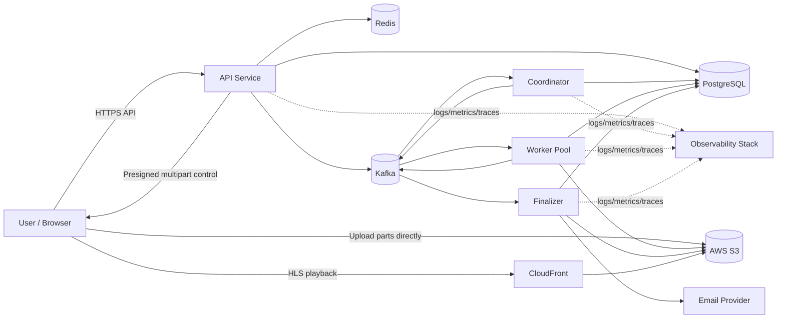
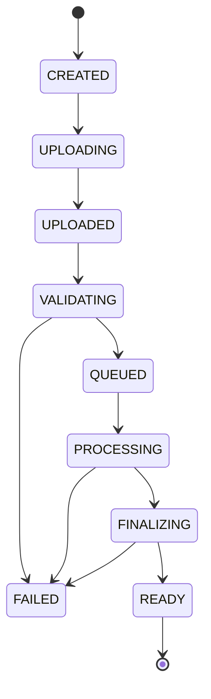
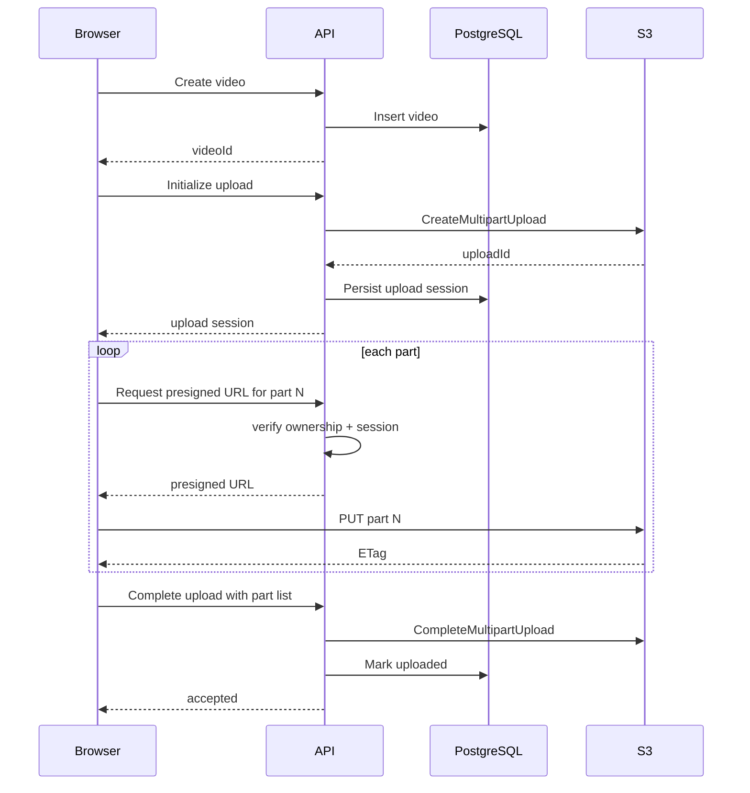

# Transflow — Architecture

## 1. Purpose

**Transflow** is a distributed video processing platform for large-file uploads, asynchronous transcoding, multi-rendition HLS generation, reliable background processing, and production-style operational visibility.

The primary product lifecycle is:

```text
Authenticate
    ↓
Create video metadata
    ↓
Select local video
    ↓
Initialize multipart upload
    ↓
Upload parts directly to S3
    ↓
Resume/retry failed parts if needed
    ↓
Complete multipart upload
    ↓
Validate uploaded media with FFprobe
    ↓
Publish processing event
    ↓
Create rendition jobs
    ↓
Distributed workers transcode in parallel
    ↓
Retry recoverable failures
    ↓
Finalize HLS output
    ↓
Mark video READY
    ↓
Serve HLS through CloudFront
    ↓
Playback
```

Supporting capabilities include:

- authentication with email/password, Google, and GitHub
- email verification and password reset
- video-ready and permanent-failure emails
- source retention preference
- worker draining
- retries, idempotency, dead-letter handling, and crash recovery
- Redis-backed caching and rate limiting
- Kubernetes deployment and horizontal scaling
- structured logs, metrics, traces, dashboards, and service-health views
- CI from Phase 0 and full CD later
- infrastructure as code with Terraform

---

# 2. Architectural principles

## 2.1 Feature-driven architecture

Technologies are introduced only when a product or operational requirement justifies them.

Examples:

- S3 appears when large uploads require object storage.
- Kafka appears when transcoding must leave the HTTP request path.
- Redis appears when caching and distributed rate limiting become real requirements.
- Kubernetes appears when independently deployable services and worker scaling exist.
- OpenTelemetry, Prometheus, and Grafana appear when the distributed system becomes difficult to diagnose from local logs alone.

This prevents the project from becoming a collection of unrelated tools.

## 2.2 Monorepo, separate deployables

Transflow uses **one Git repository** while still containing multiple microservices.

```text
transflow/
├── apps/
│   ├── api/                  # TypeScript / Express
│   ├── coordinator/          # TypeScript
│   ├── worker/               # Go transcoding worker
│   │   ├── cmd/
│   │   ├── internal/
│   │   ├── go.mod
│   │   └── ...
│   └── finalizer/            # TypeScript
├── packages/                 # TypeScript-only shared packages
│   ├── config/
│   ├── db/
│   ├── logger/
│   └── shared/
├── contracts/                # language-neutral service/event contracts
│   └── events/
├── infrastructure/
│   ├── docker/
│   ├── kubernetes/
│   └── terraform/
├── docs/
│   └── adr/
├── tests/
├── .github/
│   └── workflows/
├── docker-compose.yml
├── pnpm-workspace.yaml
├── tsconfig.base.json
├── package.json
├── .env.example
└── README.md
```

A service is defined by its **runtime/deployment boundary**, not by its repository.

Each service can have its own:

- entry point
- Docker image
- environment variables
- Kubernetes Deployment
- replica count
- health checks
- logs and metrics
- resource limits
- scaling policy

### Polyglot boundary

Transflow intentionally uses two backend languages:

| Service | Language |
|---|---|
| API / Video Service | TypeScript |
| Coordinator | TypeScript |
| Transcoding Worker | **Go** |
| Finalizer | TypeScript |

Go is used **only** for the transcoding worker/data-plane boundary. The API, business logic, coordinator, finalizer, authentication, email, PostgreSQL business layer, Redis caching/rate limiting, and frontend-facing backend remain TypeScript.

Because the worker is Go, Kafka contracts must not depend on TypeScript-only types. Cross-service payloads should use a language-neutral, versioned contract such as JSON event envelopes with JSON Schema (or an equivalently explicit schema format chosen later). TypeScript validates contracts at its boundary; Go decodes them into Go structs and validates required fields.

The goal is not to make Transflow broadly polyglot. It is to use one justified Go boundary where concurrency, subprocess management, cancellation, long-running worker lifecycle, and resource control provide meaningful learning and engineering value.

## 2.3 PostgreSQL is the durable business source of truth

PostgreSQL owns durable application state such as:

- users
- videos
- upload sessions
- upload completion state
- media metadata
- rendition records
- processing jobs
- retry state
- workflow state
- source-retention preference
- notification preferences

Redis is **not** the durable source of truth.

Kafka is **not** the source of truth for current business state.

S3 owns media objects, not relational workflow state.

## 2.4 Object storage for media, database for metadata

S3 stores:

- original source videos
- transcoded HLS media segments
- rendition playlists
- master HLS playlists

PostgreSQL stores references and metadata about those objects.

CloudFront serves HLS output from S3.

## 2.5 Long-running processing is asynchronous

Transcoding is expensive, long-running, and failure-prone. It must not execute in the request-response path.

The API records intent and exposes status. Kafka and workers execute background work.

## 2.6 At-least-once delivery is assumed

Kafka consumers must be written assuming a message may arrive more than once.

Therefore:

- consumers are idempotent
- database writes use guards/constraints
- job claiming is safe under races
- state transitions reject illegal duplicates
- finalization is repeat-safe

## 2.7 Failure is normal

The design assumes failures such as:

- client network interruption
- S3 part upload failure
- API restart
- Kafka redelivery
- worker crash
- FFmpeg crash
- corrupt or unsupported video
- dependency timeout
- duplicate event
- stale worker
- partial rendition completion
- finalizer retry
- email-provider failure

The architecture should remain correct under these conditions.

---

# 3. High-level architecture



---

# 4. Service boundaries

Transflow has four primary deployable services.

## 4.1 API / Video Service

### Responsibilities

- HTTP APIs
- authentication/session integration
- video metadata operations
- ownership checks
- upload-session creation
- S3 multipart upload control
- presigned URL generation
- upload completion and abort
- expose processing state to frontend
- expose playback metadata once READY
- user preferences
- source-retention preference
- notification preferences
- request validation
- request IDs
- centralized HTTP error handling
- rate limiting
- selected caching
- health endpoints

### Does not do

- FFmpeg transcoding
- CPU-heavy media processing
- worker scheduling
- HLS finalization
- cluster administration

### Scaling profile

The API should remain mostly stateless and scale horizontally behind a load balancer.

Persistent state belongs in PostgreSQL/S3/Redis/Kafka rather than process memory.

---

## 4.2 Transcoding Coordinator

### Responsibilities

- consume validated-video / processing-requested events
- determine required renditions
- create rendition job records
- publish rendition work
- guarantee business-level idempotency for fan-out
- make job creation observable

### Example

A 1440p source might require:

```text
1080p
720p
480p
360p
```

The coordinator creates one durable job for each required rendition.

### Why separate

The API should not own long-running workflow orchestration, and workers should execute assigned work rather than decide the global workflow.

---

## 4.3 Transcoding Worker — Go

The transcoding worker is the **only primary Transflow microservice written in Go**.

Go acts as the orchestration/runtime layer around FFmpeg. Go does **not** encode video itself; FFmpeg performs the actual media encoding.

```text
Kafka rendition job
        ↓
Go worker
├── validate/decode job
├── claim/verify idempotency
├── acquire source from S3
├── run FFprobe
├── control bounded concurrency
├── spawn FFmpeg
├── parse FFmpeg progress
├── handle timeout/cancellation
├── upload HLS output to S3
├── publish progress/result events
└── clean temporary resources
```

### Go worker responsibilities

1. Kafka **consumer** for transcoding/rendition jobs.
2. Worker process lifecycle.
3. Internal worker pool.
4. Bounded concurrency control.
5. Download or stream source media from S3 as appropriate.
6. Run `ffprobe`.
7. Spawn and supervise FFmpeg.
8. Generate the required outputs:
   - 360p
   - 480p
   - 720p
   - 1080p
   - HLS rendition playlists and segments
   - only renditions allowed by the detected source dimensions; do not upscale by default
9. Parse FFmpeg progress.
10. Report transcoding progress without producing an event/DB write for every FFmpeg frame.
11. Upload generated files to S3.
12. Use bounded concurrent S3 uploads for many generated files; use multipart upload for an individual output only when its size actually justifies multipart.
13. Job cancellation.
14. Propagate cancellation/timeouts with `context.Context`.
15. Terminate FFmpeg safely on cancellation/shutdown.
16. Graceful worker shutdown.
17. Temporary-directory/workspace management.
18. Cleanup after both success and failure.
19. Worker heartbeat/health reporting.
20. Resource and concurrency limits.
21. Retry **worker-local operations** that are safely retryable.
22. Handle duplicate Kafka messages idempotently.
23. Publish worker-owned events such as:
   - `TranscodingStarted`
   - `TranscodingProgress` (throttled/coalesced)
   - `RenditionCompleted`
   - `TranscodingFailed`
24. Export worker-side metrics including:
   - transcoding duration
   - FFmpeg duration/failures
   - active jobs
   - completed jobs
   - failed jobs
   - retry counts
   - CPU usage
   - memory usage
   - queue/job processing timings

### Events the worker does **not** own

The Go worker does **not** publish `VideoReady`.

Each worker only knows whether its own rendition finished. Global video completion belongs to the TypeScript finalizer:

```text
Go Worker A → RenditionCompleted(1080p)
Go Worker B → RenditionCompleted(720p)
Go Worker C → RenditionCompleted(480p)
Go Worker D → RenditionCompleted(360p)
                         ↓
                TypeScript Finalizer
                         ↓
            verify all required outputs
                         ↓
                     VideoReady
```

### Retry responsibility

Retry responsibility is deliberately split.

The Go worker may retry short-lived local operations such as:

- transient S3 download/upload failures
- transient network calls
- safe process-adjacent operations

The overall job-attempt policy remains visible to the distributed workflow:

```text
attempt 1
→ worker reports retryable failure
→ backoff / reschedule
→ attempt 2
→ ...
→ max attempts exhausted
→ permanent failure / DLQ
```

The worker must report stable error codes and whether a failure is retryable; it must not hide the entire job retry lifecycle inside one process.

### Progress reporting

FFmpeg can emit progress very frequently. The worker should parse it, but progress publication should be throttled/coalesced.

For example:

```text
FFmpeg frame-level progress
        ↓
Go parser
        ↓
coalesce/throttle
        ↓
TranscodingProgress
        ↓
API-visible job progress
```

The system should avoid writing PostgreSQL on every frame. Coarse durable progress can be persisted; hot/transient progress can later use a more suitable mechanism if required.

### Worker heartbeats

The Go worker should expose process health and later emit/record a low-frequency application-level heartbeat or last-seen signal where useful.

Heartbeats must not become high-frequency durable PostgreSQL write noise. Kubernetes probes and Prometheus metrics remain the primary infrastructure-health mechanisms; application-level worker last-seen status can be layered on top when the Workers UI requires it.

### Scaling profile

The worker is the most horizontally scaled service.

Example deployment:

```text
API:          2 replicas
Coordinator:  1–2 replicas
Go Worker:    3–20 replicas
Finalizer:    1–2 replicas
```

Each Go worker process also has its own **bounded internal concurrency**. Kubernetes replica count and per-worker concurrency are separate controls.

### Worker draining

Worker states:

- Active
- Busy
- Draining
- Offline

A draining Go worker:

1. stops claiming new Kafka work
2. cancels or finishes work according to shutdown policy
3. allows in-flight FFmpeg jobs to finish when safe
4. stops/terminates child processes when the grace period requires it
5. flushes result events/telemetry
6. removes temporary files
7. closes Kafka/S3/telemetry resources
8. exits cleanly

This supports Kubernetes rolling deployments and controlled replacement.

---

## 4.4 Finalizer

### Responsibilities

- consume rendition-completion events
- determine whether all required renditions are complete
- generate/verify the HLS master playlist
- update video state to READY
- publish final completion event
- apply source-retention behavior when safe
- trigger ready/failure notification path
- remain idempotent under duplicate completion events

### Why separate

Finalization is a **fan-in** step. Each worker sees one rendition; the finalizer evaluates the entire video workflow.

---


# 5. Language ownership and cross-language contracts

## TypeScript owns the control plane

TypeScript remains responsible for:

- Express API
- authentication and authorization
- video/upload APIs
- PostgreSQL business/domain layer
- coordinator
- finalizer
- Redis caching and rate limiting
- email/notification orchestration
- user/video business rules

## Go owns the transcoding data plane

Go is responsible only for the dedicated worker responsibilities described above.

## Cross-language contract rule

Do not import TypeScript package types into the Go worker conceptually or recreate ad-hoc payloads independently.

Kafka messages should use a versioned envelope, for example conceptually:

```json
{
  "eventId": "evt_...",
  "eventType": "RenditionJobCreated",
  "eventVersion": 1,
  "occurredAt": "2026-...",
  "traceContext": {},
  "data": {}
}
```

Contract fields should be documented in a language-neutral schema directory. Breaking changes require explicit versioning.

This is especially important because TypeScript compile-time types cannot protect the Go consumer and Go structs cannot protect the TypeScript producer.

---

# 6. Core domain model

The exact schema should be finalized during implementation, but the conceptual model is:

## User

```text
User
- id
- email
- password_hash / external identity metadata
- email_verified
- created_at
- updated_at
```

## User preferences

```text
UserPreference
- user_id
- keep_original_source
- email_on_video_ready
- email_on_video_failed
```

## Video

```text
Video
- id
- user_id
- filename
- status
- source_object_key
- source_size_bytes
- detected_container
- detected_video_codec
- detected_audio_codec
- width
- height
- duration_ms
- frame_rate
- created_at
- uploaded_at
- ready_at
- failed_at
```

## Upload session

```text
UploadSession
- id
- video_id
- s3_upload_id
- object_key
- expected_size_bytes
- state
- created_at
- completed_at
- aborted_at
```

Upload part metadata may also be persisted when useful for resume visibility and verification.

## Rendition

```text
Rendition
- id
- video_id
- profile
- target_width
- target_height
- target_bitrate
- playlist_object_key
- state
- output_size_bytes
- processing_started_at
- processing_completed_at
```

## Processing job

```text
ProcessingJob
- id
- rendition_id
- state
- attempt
- max_attempts
- worker_id
- error_code
- error_message_safe
- claimed_at
- started_at
- completed_at
- next_retry_at
```

---

# 7. State machines

## 6.1 Video state machine



State transitions should be explicit and validated.

A duplicate event must not accidentally move a READY video back to PROCESSING.

## 6.2 Rendition/job states

A rendition/job can conceptually move through:

```text
PENDING
→ QUEUED
→ CLAIMED
→ PROCESSING
→ COMPLETED
```

or through retry/failure paths:

```text
PROCESSING
→ RETRY_SCHEDULED
→ QUEUED
```

and finally:

```text
PROCESSING
→ FAILED_PERMANENTLY
```

---

# 8. Upload architecture

## 7.1 Why uploads bypass the API data path

A multi-gigabyte file should not travel:

```text
Browser → Node API → S3
```

That would create:

- unnecessary API bandwidth
- long HTTP connections
- memory/disk pressure
- poor retry behavior
- unnecessary scaling cost

Instead:

```text
Browser → API for authorization/control
Browser → S3 for actual file bytes
```

## 7.2 Multipart upload flow



## 7.3 Resume/retry behavior

The client can retain:

- upload session ID
- completed part numbers
- ETags

A failed part is retried independently instead of restarting the entire file.

Concurrency should be **bounded**, not unlimited.

Completion is idempotent. The API verifies the submitted part list, completed-object size, and available checksum/integrity metadata before moving the durable upload session forward. Repeating completion must return the existing result rather than corrupting state.

Abandoned uploads are cleaned by application reconciliation, with an S3 lifecycle rule as a safety net.

## 7.4 Pre-upload validation

Before upload, only validate what the browser can reasonably know:

- filename
- file size
- extension/content type
- allowed-file rules

## 7.5 Post-upload validation

After S3 upload completes:

```text
S3 object
  ↓
FFprobe
  ↓
container
codec
resolution
duration
frame rate
valid / invalid
```

Only valid media proceeds to transcoding.

Detected codec, dimensions, duration, frame rate, audio information, and validation outcome are persisted through the TypeScript-owned business-state boundary. The Go worker returns this metadata in its result; it does not become a general-purpose writer of business tables.

---

# 9. Asynchronous processing architecture

## 8.1 Event chain

Conceptually:

```text
video.upload.completed
        ↓
media.validation.succeeded
        ↓
video.processing.requested
        ↓
coordinator
        ↓
rendition.job.created × N
        ↓
Go worker pool
        ↓
TranscodingStarted / TranscodingProgress
        ↓
RenditionCompleted / TranscodingFailed
        ↓
TypeScript finalizer
        ↓
VideoReady / VideoFailed
```

Exact event/topic names should be documented in ADRs.

## 8.2 Kafka partitioning

Partition keys should preserve ordering where necessary.

Candidates:

- `videoId` for video-level workflow events
- `renditionId` or `jobId` for work events

The key must be chosen intentionally.

Each event uses a versioned language-neutral schema and stable `eventId`. Consumers acknowledge/commit work only after the outcome is durably represented or safely published. The database-to-Kafka failure window must have an explicit reconciliation or transactional-outbox strategy by Phase 6.

## 8.3 Consumer groups

Worker replicas share one worker consumer group so Kafka distributes work among them.

Coordinator and finalizer use separate consumer groups because they perform different logical work.

---

# 10. Idempotency strategy

At-least-once delivery means duplicate delivery is expected.

## Coordinator

Before creating rendition jobs:

- check whether jobs already exist
- use unique constraints
- create jobs transactionally where appropriate
- make duplicate processing requests harmless

## Go worker

Before starting:

- decode and validate the language-neutral job contract
- atomically claim/verify job state if the worker participates in the claim path
- ignore already-completed jobs
- use stable output naming
- make S3 writes repeat-safe
- prevent duplicate conflicting output
- ensure a duplicate Kafka delivery cannot launch an inconsistent second successful rendition
- keep cancellation tied to the job `context.Context`
- classify errors with stable error codes and retryable/permanent semantics

## Finalizer

Before marking READY:

- verify all required renditions
- treat repeated completion events as no-ops if already READY

## API

Repeated upload-complete requests must not corrupt state.

Idempotency keys can be introduced later only where they solve a real API retry problem.

---

# 11. Retry and failure model

## 10.1 Retryable failures

Examples:

- temporary S3 failure
- transient network issue
- dependency timeout
- temporary Kafka failure
- worker interruption

## 10.2 Non-retryable failures

Examples:

- unsupported codec
- corrupt source media
- invalid media
- deterministic FFmpeg failure caused by bad input
- authorization failure

## 10.3 Retry policy

Use:

- bounded attempts
- exponential backoff
- jitter
- explicit attempt tracking
- no infinite retries

### Worker-local retries vs job retries

The Go worker may retry an individual network/storage operation when it is safe to do so. It should not silently perform unlimited full transcoding attempts.

The distributed workflow owns the visible rendition-job attempt count. A failed Go worker attempt produces a structured result/event; the coordinator/job-state logic decides whether the job should be retried, delayed, or dead-lettered.

Stale claims require a lease/timeout recovery policy. Recovery must use conditional state transitions so a replacement worker cannot overwrite the result of a still-valid attempt.

## 10.4 Dead-letter handling

After retry exhaustion:

```text
job
 ↓
FAILED_PERMANENTLY
 ↓
dead-letter topic/state
 ↓
operator visibility
 ↓
video-level failure resolution
```

DLQ state is visible to users/operators, but retry/DLQ policy is not configurable from the product UI.

---

# 12. Error architecture

Low-level failures should be translated before reaching transport code.

```text
PostgreSQL / Redis / Kafka / S3 / FFmpeg
                 ↓
            translate
                 ↓
         application error
                 ↓
        ┌────────┴────────┐
        │                 │
      HTTP              Worker
        │                 │
 status + JSON       retry / DLQ
```

A shared application error can carry:

- stable error code
- safe message
- retryable flag
- underlying cause
- optional details
- HTTP status when relevant

Express middleware should:

- normalize known errors
- log full internal context
- return safe JSON
- include request ID
- never expose secrets or stack traces
- return correct status codes

Workers use the same semantic failures to decide retry/DLQ behavior.

---

# 13. API design conventions

## Resource-oriented routes

Prefer:

```http
POST /api/v1/videos
GET  /api/v1/videos
GET  /api/v1/videos/:videoId
```

rather than RPC-style names such as `/createVideo`.

## Error envelope

A stable shape such as:

```json
{
  "error": {
    "code": "VIDEO_NOT_FOUND",
    "message": "Video not found",
    "requestId": "..."
  }
}
```

## Validation boundary

```text
HTTP request
  ↓
validate params/query/body
  ↓
application/domain logic
  ↓
data/infrastructure layer
```

## Status semantics

Examples:

- 200 — successful read/update
- 201 — resource created
- 202 — asynchronous work accepted
- 204 — successful no-body response
- 400 — malformed request
- 401 — unauthenticated
- 403 — authenticated but forbidden
- 404 — resource absent
- 409 — state/resource conflict
- 422 — semantically invalid input where appropriate
- 429 — rate limited
- 500 — unexpected internal failure
- 503 — temporarily unavailable dependency/service

---

# 14. Caching architecture

Redis is introduced only for justified read-heavy paths.

Cache-aside pattern:

```text
request
  ↓
Redis
 ├─ hit → return
 └─ miss
      ↓
   PostgreSQL
      ↓
   cache result
      ↓
   response
```

Requirements:

- TTL
- invalidation strategy
- key versioning
- Redis failure fallback
- metrics
- stampede mitigation where needed

Redis never becomes durable workflow state.

---

# 15. Distributed rate limiting

Redis coordinates limit state across multiple API replicas.

Potential dimensions:

- authenticated user ID
- IP for unauthenticated routes
- endpoint class

Algorithm should be chosen deliberately, likely token bucket or a similarly suitable approach.

Responses should use:

```text
429 Too Many Requests
Retry-After: ...
```

---

# 16. Authentication and authorization

Supported authentication:

- email/password
- Google OAuth
- GitHub OAuth
- email verification
- forgot/reset password

Not included:

- SAML
- enterprise SSO
- MFA
- organizations
- team invitations
- organization RBAC
- API keys

Authorization is ownership-based:

```text
user
  ↓ owns
video
  ↓ owns
upload sessions / renditions / status visibility
```

A user must never access another user's video resources.

---

# 17. Email architecture

Supported product emails:

- email verification
- password reset
- video READY
- video permanently failed

Ready/failure notifications should be asynchronous where practical:

```text
video.ready
   ↓
notification handler
   ↓
email provider
```

Email failure must not change a successfully processed video back to failed.

Email is a side effect, not part of the critical media transaction.

---

# 18. Source retention

User preference:

```text
Keep original uploaded video after processing
```

If disabled, source deletion occurs only after:

- all required renditions complete
- final HLS output is valid
- video is READY
- deletion can be performed idempotently

The system must never delete the only valid source during incomplete processing.

---

# 19. HLS output architecture

Conceptually:

```text
source video
   ↓
inspect source dimensions
   ↓
select source-appropriate ladder (no default upscaling)
   ↓
FFmpeg
   ├── 1080p segments + playlist
   ├── 720p segments + playlist
   ├── 480p segments + playlist
   └── 360p segments + playlist
               ↓
        master playlist
```

S3 stores HLS assets.

CloudFront serves them.

PostgreSQL stores logical metadata and object references.

A stable object-key convention can resemble:

```text
videos/{videoId}/source/...
videos/{videoId}/hls/1080p/...
videos/{videoId}/hls/720p/...
videos/{videoId}/hls/480p/...
videos/{videoId}/hls/360p/...
videos/{videoId}/hls/master.m3u8
```

Exact names are implementation decisions.

---

# 20. Kubernetes deployment architecture

Each primary service gets an independent Deployment:

```text
API Deployment
Coordinator Deployment
Worker Deployment
Finalizer Deployment
```

Important concerns:

- Services where network exposure is needed
- ConfigMaps and Secrets
- resource requests/limits
- ephemeral-storage requests/limits for worker temporary workspaces
- non-root security contexts and least-privilege filesystem access
- liveness/readiness probes
- rolling deployments
- HPA where justified
- worker scaling based on measured saturation and queue backlog/lag where practical, rather than CPU alone
- graceful termination
- worker draining

Workers scale independently from API traffic.

---

# 21. Observability architecture

## Logs

TypeScript services use Pino structured logs. The Go worker uses structured JSON logging (preferably Go's `log/slog` unless a stronger need appears).

Across both languages, logs should eventually include:

- service
- requestId
- traceId
- videoId
- uploadId
- renditionId
- jobId
- workerId
- errorCode
- attempt

Credentials, tokens, presigned URLs, and other sensitive values must be redacted consistently. Metrics use bounded labels; IDs such as `videoId`, `jobId`, and `userId` belong in logs/traces, not Prometheus labels.

## Metrics

### API
- request rate
- error rate
- p50/p95/p99 latency
- rate-limit count

### Upload
- upload completion count
- failed uploads
- part retries

### Kafka
- consumer lag
- processing rate
- consume failures

### Go worker
- active workers
- busy workers
- draining workers
- active jobs
- transcoding duration
- FFmpeg duration
- CPU usage
- memory usage
- jobs completed
- jobs failed
- FFmpeg failures
- retries
- cancellation count
- temporary-workspace cleanup failures

### Processing
- end-to-end processing duration
- queue wait time
- rendition success/failure rate

### Cache
- hit ratio
- miss ratio
- Redis error count

## Traces

OpenTelemetry should connect work across:

```text
HTTP request
→ PostgreSQL
→ Kafka producer
→ TypeScript Coordinator consumer
→ Go Worker consumer
→ S3 / FFprobe / FFmpeg
→ TypeScript Finalizer
```

Async trace context propagation must be explicit.

## Dashboards

Grafana should surface:

- system health
- Kafka lag
- worker utilization
- processing latency
- failure rate
- API latency
- cache behavior

---

# 22. CI/CD architecture

## Phase 0 CI

Every push/PR should run:

```text
install TypeScript dependencies with the frozen lockfile
→ TypeScript typecheck/lint/format check
→ TypeScript tests
→ build TypeScript services
```

PostgreSQL integration tests can use a service container.

## CI from Phase 3

When production Go code begins, add:

```text
install Go dependencies
→ gofmt check
→ go vet
→ Go tests (`go test ./...`)
→ targeted race-detector tests where appropriate
→ build Go worker
```

## Later CD

```text
commit
  ↓
CI
  ↓
build service images
  ↓
push to registry
  ↓
deploy Kubernetes
  ↓
readiness verification
  ↓
rolling rollout
```

CD is delayed until deployment infrastructure exists.

---

# 23. Terraform architecture

Terraform eventually provisions infrastructure such as:

- networking
- S3
- IAM
- container registry
- Kubernetes infrastructure
- CloudFront
- managed database/cache/messaging where practical

Terraform does not replace Kubernetes.

```text
Terraform → provisions infrastructure
Kubernetes → schedules/manages workloads inside it
```

Important final-phase topics:

- state
- remote state
- locking
- drift
- modules
- safe plan/apply
- imports/lifecycle concepts

---

# 24. Security boundaries

Important constraints:

- client never receives permanent AWS credentials
- presigned URLs are scoped and short-lived
- ownership checked before upload URL issuance
- object keys generated server-side
- file size/type restrictions
- post-upload media validation
- secrets never committed
- stack traces never exposed to clients
- parameterized SQL everywhere
- authentication required for protected resources
- rate limiting on abuse-prone endpoints
- least-privilege IAM
- secure container defaults later
- HLS access policy matches intended product behavior
- S3 media buckets remain private; CloudFront uses private origin access rather than a public bucket
- authentication secrets, reset tokens, presigned URLs, and provider credentials are never logged

Production-style data protection remains intentionally small but explicit:

- PostgreSQL backups have a retention policy and a tested restore procedure
- S3 lifecycle/retention rules match source-retention preferences and generated-output needs
- schema migrations use backward-compatible rollout patterns once CD begins
- recovery and rollback steps are documented and exercised at least once

---

# 25. Deliberate non-goals

The MVP explicitly avoids:

- live streaming / RTMP
- DRM
- custom codecs
- AI features
- Elasticsearch
- gRPC in MVP
- service mesh
- multi-region active-active
- external S3 ingestion
- organization/team management
- API key management
- enterprise SSO
- browser push notifications
- weekly email summaries
- multi-cluster management UI
- PostgreSQL replica management UI
- spot-instance management UI
- user-configurable Kafka/DLQ/retry infrastructure policies

Possible later polish:

- **gRPC** only if a real synchronous internal RPC need appears
- **Elasticsearch** only if a genuine full-text/indexed-search problem appears

---

# 26. Final architecture definition of done

A user can:

```text
authenticate
→ create a video
→ upload a multi-GB file using multipart S3 upload
→ recover from part failures
→ complete upload
→ validate media
→ trigger asynchronous processing
→ fan out multiple renditions
→ process on distributed workers
→ survive duplicate messages and worker failures
→ retry safely
→ surface permanent failures
→ finalize HLS
→ mark the video READY
→ receive ready/failure email when enabled
→ stream through CloudFront
```

The engineering system also provides:

- PostgreSQL durable state
- Redis caching/rate limiting
- Kafka async processing
- Docker local integration
- Kubernetes deployment
- worker draining
- logs/metrics/traces
- load/failure testing
- CI/CD
- Terraform
- architecture documentation and ADRs
